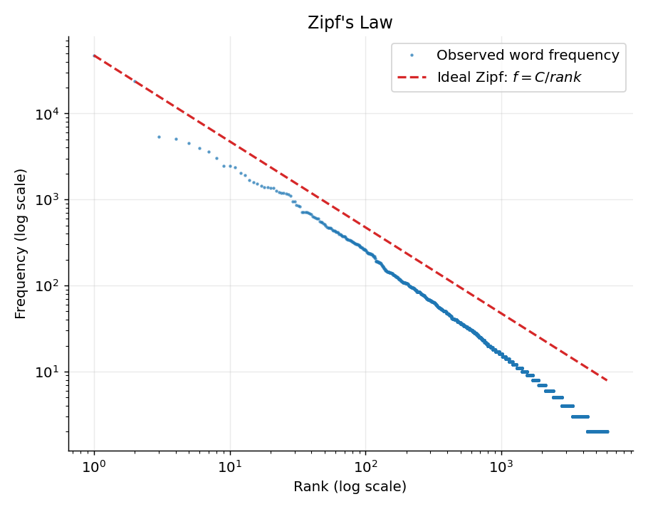
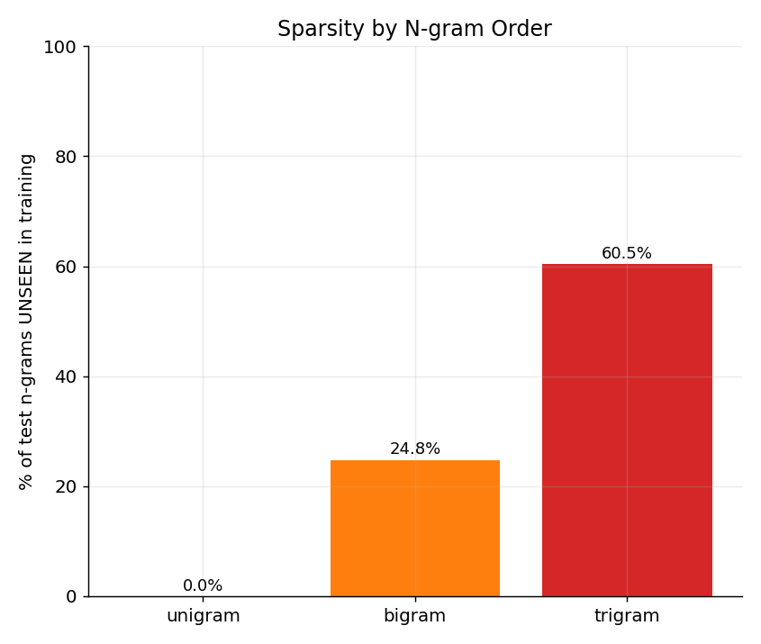
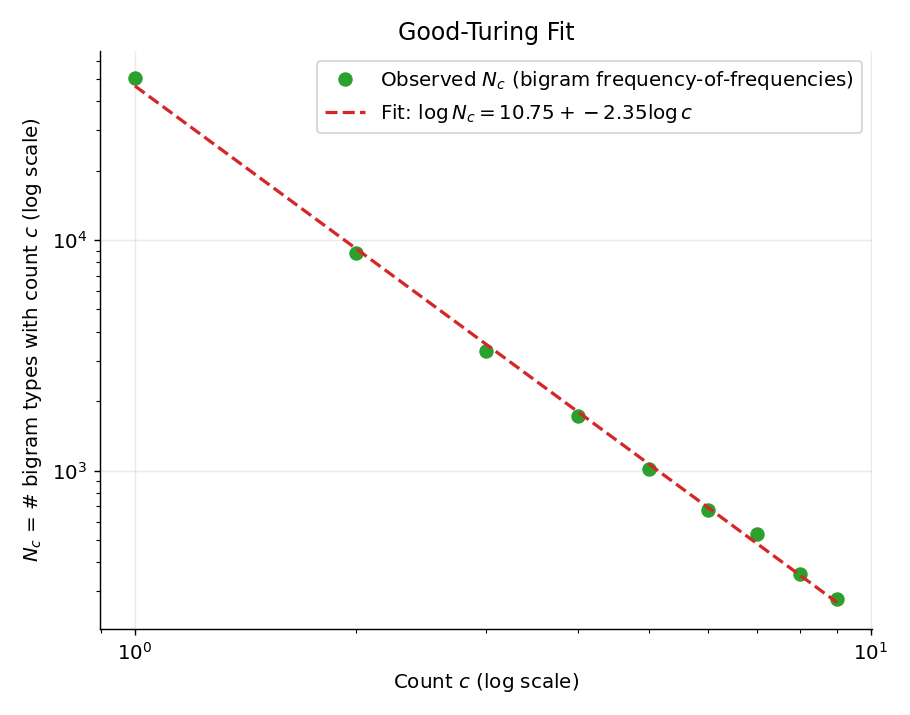
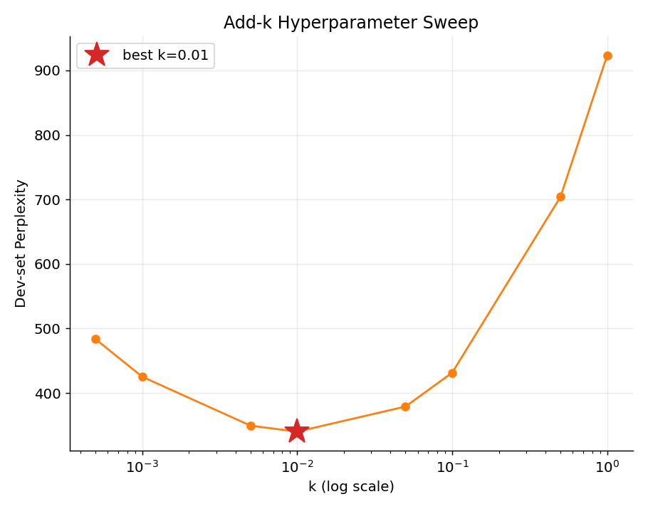
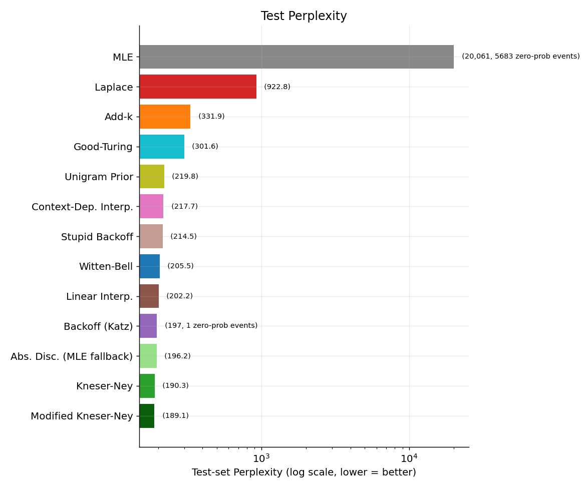
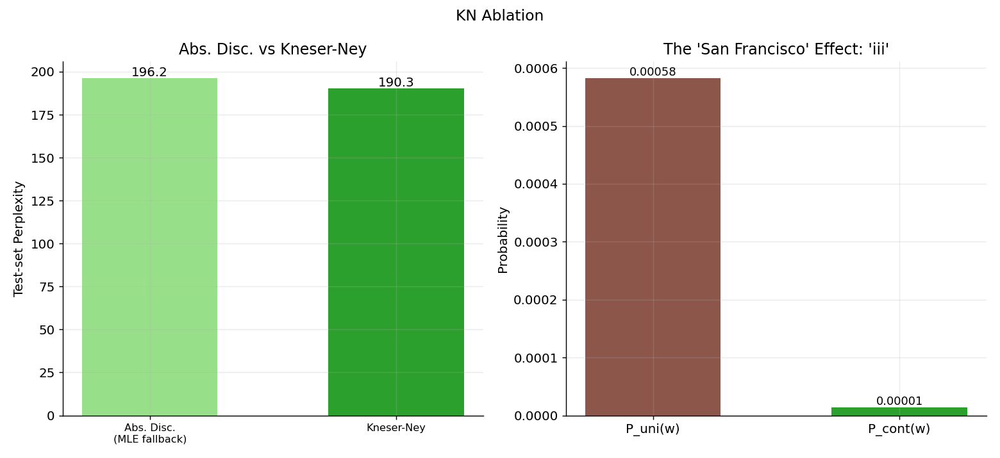
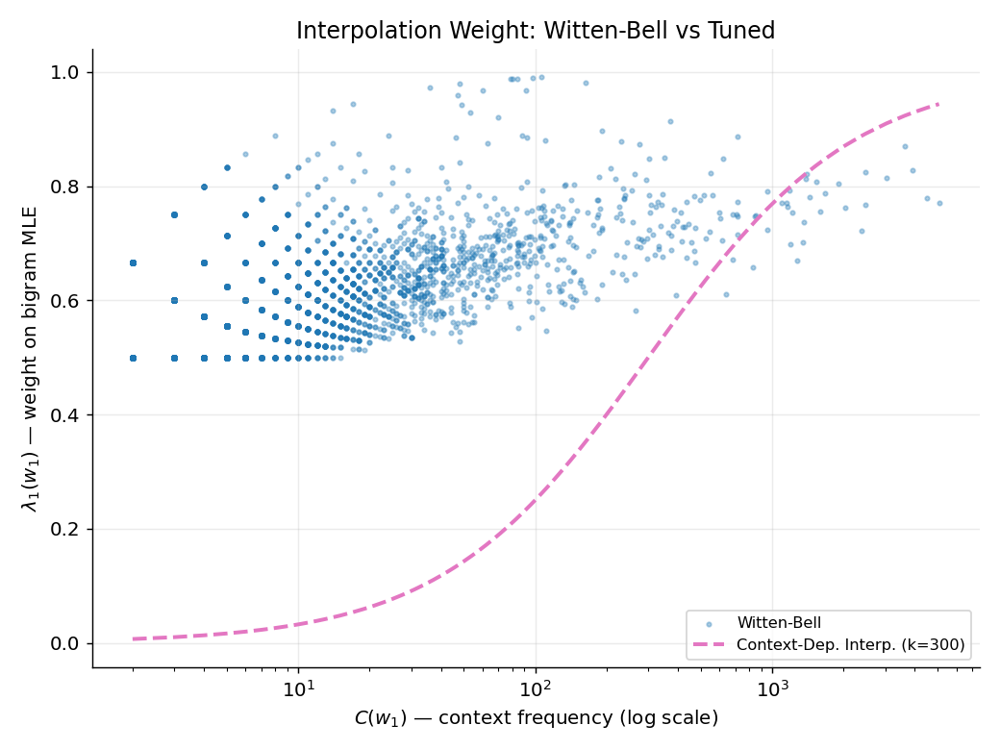
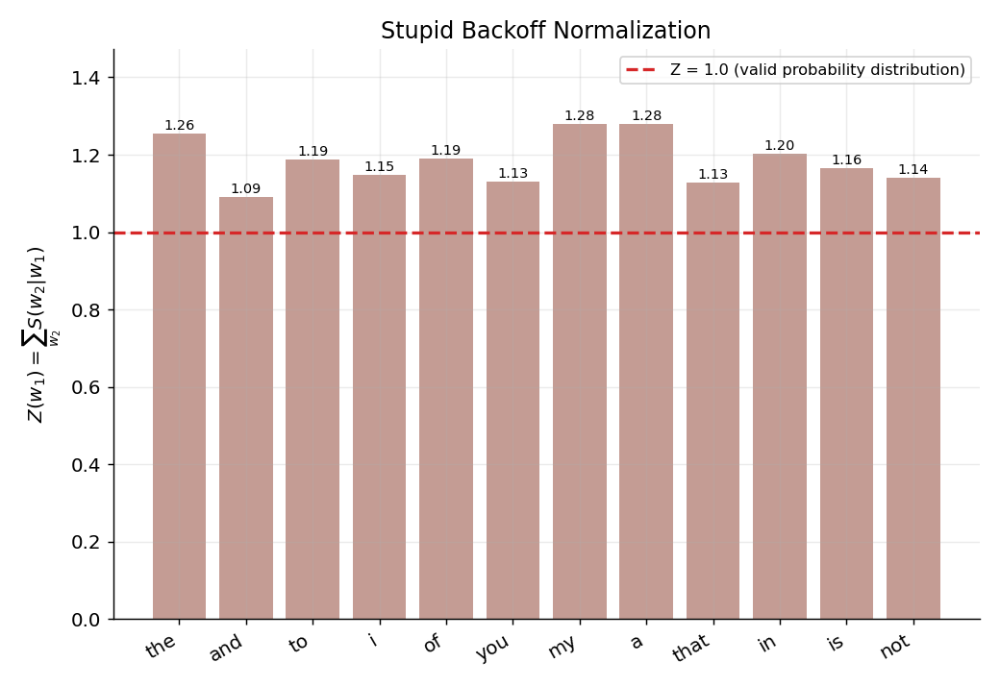
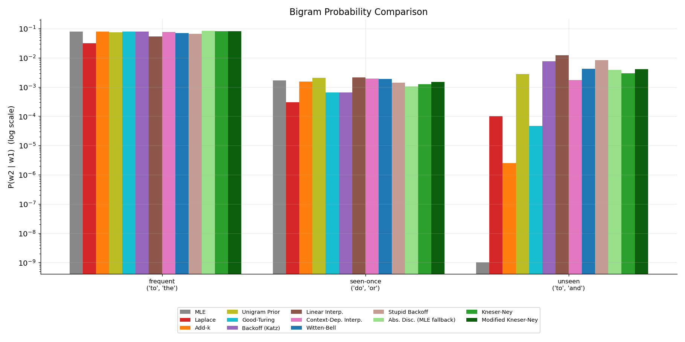
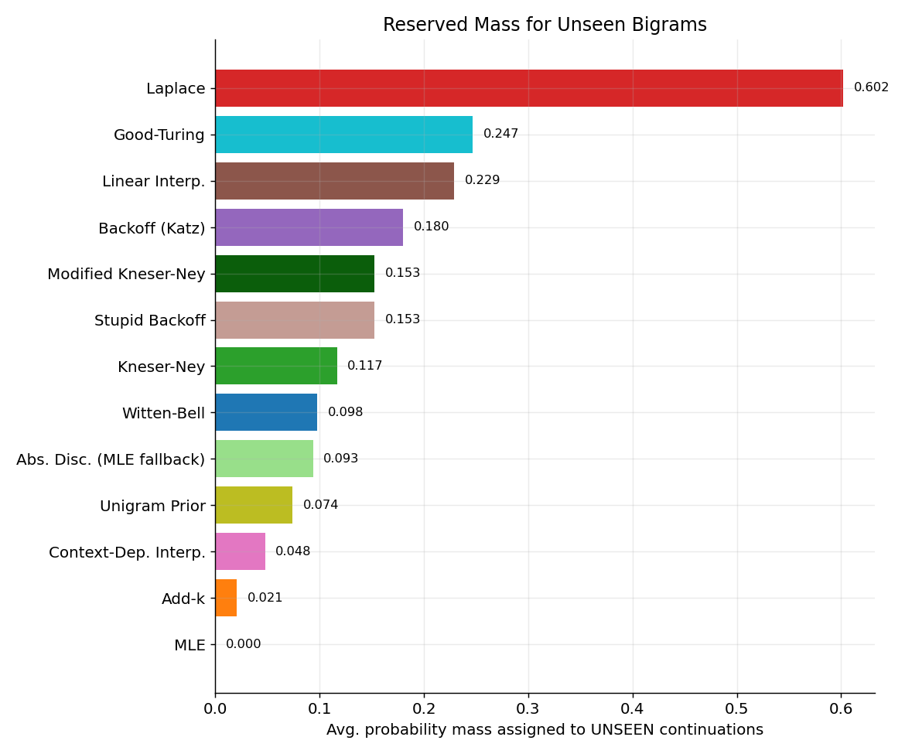

# N-gram Smoothing: Implementation & Impact Analysis

**Corpus:** Tiny Shakespeare (~203K words, 29,616 sentences), word-tokenized, lowercased,
split 80/10/10 into train/dev/test. Words occurring once in train are folded into `<UNK>`.
Vocabulary size V = 6,009. Train tokens N = 181,975. All 13 methods estimate **P(w2 | w1)**
(bigram level) so they're directly comparable; hyperparameters were grid-searched on
**dev** and results reported on held-out **test**.

## Files
| File | Purpose |
|---|---|
| `preprocess.py` | Downloads corpus, tokenizes, splits, builds unigram/bigram/trigram counts |
| `smoothing.py` | All 13 probability formulas (MLE → Modified Kneser-Ney) |
| `evaluate.py` | Hyperparameter tuning (dev) + perplexity/mass/ablation evaluation (test) |
| `visualize.py` | Generates all 10 plots |

Run in order: `python3 preprocess.py && python3 evaluate.py && python3 visualize.py`

## 1. Zero-Probability Problem

The corpus obeys Zipf's law closely (log-log rank-frequency plot is near-linear). That
long tail is exactly why smoothing is necessary: **24.8%** of test bigrams and **60.5%**
of test trigrams never occurred in training, even though 0% of test unigrams are OOV
(thanks to `<UNK>`). Sparsity gets *worse*, not better, as n grows the core motivation
for every technique below.

## 2. Good-Turing Fit

Raw frequency-of-frequencies $N_c$ is noisy at higher $c$, so a log-log linear regression
$\log N_c = a + b\log c$ was fit ($a$=10.75, $b$=-2.35) and used to compute smoothed
Good-Turing counts $c^*$. The reserved probability mass for *all* unseen bigrams,
$N_1/N_{bigram\ tokens}$, comes out to **0.247** i.e. Good-Turing believes about 25% of
probability mass belongs to bigrams we haven't seen yet, consistent with the sparsity
measurement above.

## 3. Hyperparameter Tuning

Grid search on dev perplexity:
- Add-k: best **k = 0.01** (dev PP 340) note k=1, i.e. Laplace, is drastically worse (PP 923) on dev too
- Unigram Prior: best **m = 500**
- Linear Interpolation: best **λ₁ = 0.5**
- Context-Dependent Interpolation: best **k = 300**
- Kneser-Ney discount (closed-form, not tuned): **d = 0.742**

The add-k curve is U-shaped: too little smoothing (k→0) underfits unseen events, too much
(k→1) over-flattens the distribution and hurts the seen events it was fitting well.

## 4. Final Test Perplexity — the main impact result

| Method | Test Perplexity | Zero-prob test events |
|---|---:|---:|
| **Modified Kneser-Ney** | **189.1** | 0 |
| Kneser-Ney | 190.3 | 0 |
| Abs. Disc. (MLE fallback) | 196.2 | 0 |
| Backoff (Katz) | 196.8 | 1 |
| Linear Interpolation | 202.2 | 0 |
| Witten-Bell | 205.5 | 0 |
| Stupid Backoff (normalized) | 214.5 | 0 |
| Context-Dependent Interp. | 217.7 | 0 |
| Unigram Prior | 219.8 | 0 |
| Good-Turing | 301.6 | 0 |
| Add-k (tuned) | 331.9 | 0 |
| Laplace | 922.8 | 0 |
| MLE (no smoothing) | **20,061.2** | 5,683 / 22,929 |

**Takeaways:**
- MLE is catastrophic: **24.8% of test predictions get probability zero**, which is what
  drives perplexity to ~20,000 (mathematically it's undefined/infinite; we floor at
  1e-12 just to get a finite number to plot). This is the zero-probability problem made
  concrete.
- Laplace "fixes" the zero but overcorrects by adding 1 to every one of 6,009 vocab words
  steals so much mass from seen bigrams that it's *5x worse* than tuned Add-k.
- **Modified Kneser-Ney now takes the top spot**, edging out single-discount KN is exactly
  as Chen & Goodman's 1999 study predicts, and consistent with it being the default in
  SRILM/KenLM.
- **Witten-Bell (205.5) beats the hand-tuned Context-Dependent Interpolation (217.7)**
  despite needing zero grid search, its data-driven weight is simply a better-informed
  choice than a single global constant $k$ fit on dev.
- **Stupid Backoff (214.5, normalized for fair comparison)** is solidly mid-pack here is
  worse than every true discounting method, which matches expectations: its whole value
  proposition (skip normalization, use a fixed 0.4 backoff) only pays off at web scale
  where raw counts are already reliable. On a 182K-token corpus it doesn't have that
  luxury.

## 5. KN Ablation: Where Does Kneser-Ney's Advantage Actually Come From?

Kneser-Ney = absolute discounting + continuation probability. To isolate the two
ingredients, `Abs. Disc. (MLE fallback)` uses the *same* discount but falls back to
plain unigram probability $P(w_2)$ instead of $P_{cont}(w_2)$:

- Abs. Disc. (MLE fallback): **196.2** test PP
- Kneser-Ney (continuation): **190.3** test PP
- → continuation probability alone is worth **5.9 PP (3.0% relative)**

The concrete mechanism: the word **"iii"** occurs 106 times in training (Shakespeare's
scene headings, "ACT III", "SCENE III", etc.) giving it a deceptively high raw unigram
probability ($P_{uni}=0.00058$), but it only ever *follows one single distinct word*, so
its continuation probability is tiny ($P_{cont}=0.00001$). Plain MLE-fallback smoothing
would over-recommend "iii" as a generic backoff guess after any unseen context; Kneser-Ney
correctly recognizes it's not a versatile word and suppresses it. This is the textbook
"San Francisco" effect, reproduced exactly in this corpus.

## 6. Witten-Bell: Data-Driven Weighting Beats Hand-Tuning

Witten-Bell's $\lambda(w_1)=C(w_1)/(C(w_1)+T(w_1))$ and my earlier Context-Dependent
Interpolation $\lambda(w_1)=C(w_1)/(C(w_1)+k)$ share the same *shape* as both trust the
bigram MLE more as the context gets better attested, but Witten-Bell replaces the single
global constant $k$ with $T(w_1)$, the actual number of distinct words that follow $w_1$
in the data. The scatter plot shows real per-context variation the constant-$k$ curve
can't capture: contexts followed by many different words (high $T$) get pushed toward
the unigram fallback even if they're individually frequent, while "template" contexts
that are almost always followed by the same word or two keep a high bigram weight. That
data-driven flexibility is exactly why it beats the tuned version on test perplexity.

## 7. Stupid Backoff Doesn't Produce a Real Probability Distribution

By construction, summing Stupid Backoff's raw score over the full vocabulary for any
context gives $Z(w_1) = 1 + 0.4\times(\text{leftover unigram mass})$ is always **greater
than 1**, since the seen continuation mass already sums to exactly 1.0 on its own before
the extra backoff term is added on top. Measured $Z(w_1)$ across 12 frequent contexts
averaged **1.18** (up to 1.28 for some contexts). This is intentional, not a bug. Stupid
Backoff is used for *relative* scoring (e.g. ranking machine-translation hypotheses), not
as a calibrated probability, and skipping normalization is precisely what makes it cheap
enough for web-scale corpora. The version in the leaderboard above is a *normalized*
variant (divided by $Z(w_1)$) added specifically so perplexity comparison is fair.

## Bottom line
Ranked by test perplexity (best → worst):
**Modified KN < Kneser-Ney < Abs.Disc.(MLE) < Katz < Linear Interp. < Witten-Bell <
Stupid Backoff < Context-Dep. Interp. < Unigram Prior < Good-Turing < Add-k < Laplace <
MLE**. This matches the standard NLP-textbook consensus (Jurafsky & Martin; Chen &
Goodman 1999): methods that discount-and-redistribute using a *linguistically informed*
lower-order distribution (continuation probability, multiple discounts) beat methods that
redistribute uniformly (Laplace/Add-k) or via raw unigram frequency alone.

## 8. Where Does the Probability Mass Go?

Three representative bigrams (all real Shakespeare words, C(w1) shown for context):
- **"to the"** (seen 312 times, C(to)=3925) all methods roughly agree (~0.03–0.08),
  since there's enough data that smoothing barely perturbs a well-observed event.
- **"do or"** (seen exactly once) this is where methods diverge most: Laplace crushes
  it to 3e-4, while MLE/Linear-Interp keep it near its raw (noisy) MLE value of 1.7e-3.
- **"to and"** (never seen, but "and" is a very common word) MLE gives exactly 0.
  Add-k gives a near-zero 2.5e-6 (appropriately skeptical "to and" is bad English).
  Linear Interpolation gives a comparatively large 1.2e-2, because it blends in 50% raw
  unigram probability of "and" *regardless of context plausibility* a concrete
  illustration of interpolation's main weakness (over-trusting the lower-order model
  even for implausible combinations). Kneser-Ney (3.0e-3) and Katz backoff (7.6e-3) sit
  in between, closer to what a linguistically reasonable estimate should look like.

The mass-reserved chart confirms this at scale: Laplace reserves **60%** of probability
for unseen continuations on average (way too much, it barely believes what it's seen),
Add-k and Context-Dependent Interpolation reserve the least (2–5%, tight around the
tuned optimum), and Good-Turing/Katz/Kneser-Ney/Modified-KN land in a reasonable 12–25%
middle range. Stupid Backoff (15%) and Witten-Bell (10%) fall in that same sensible band
despite needing no tuning at all and further evidence that data-driven weighting is a
genuinely good substitute for a grid search, not just a convenient shortcut.